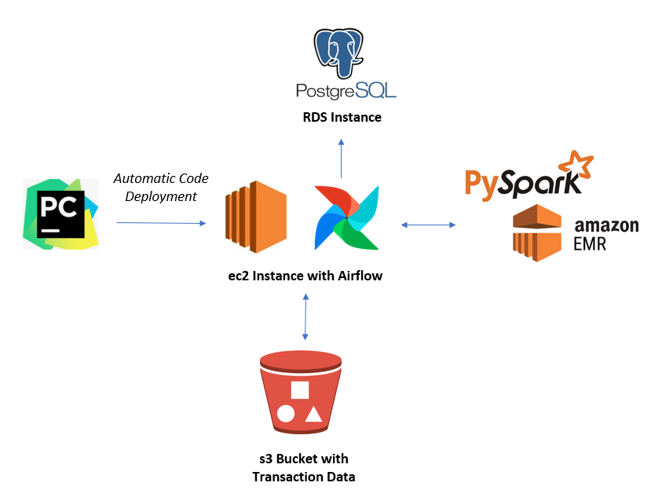
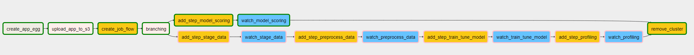
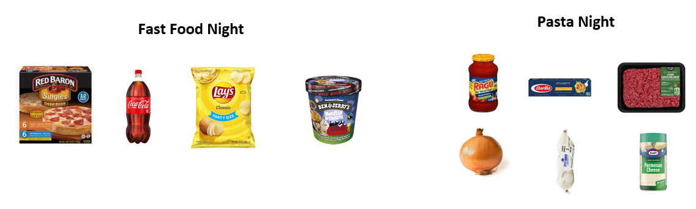
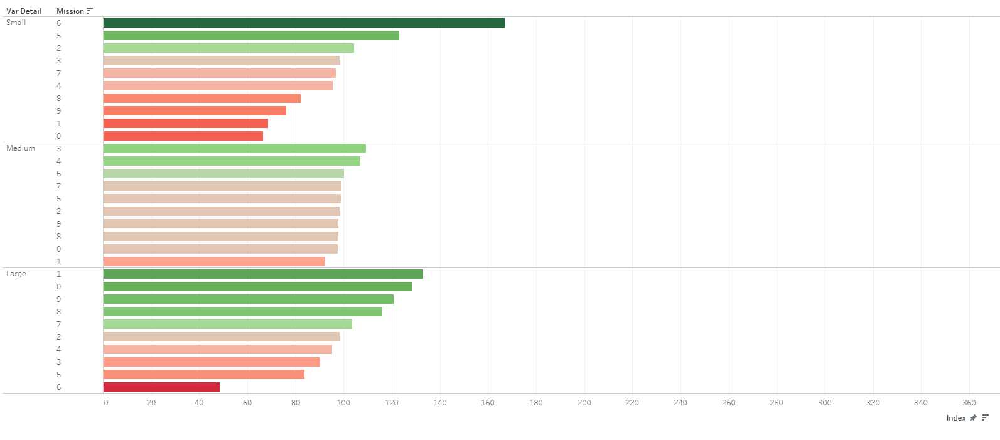
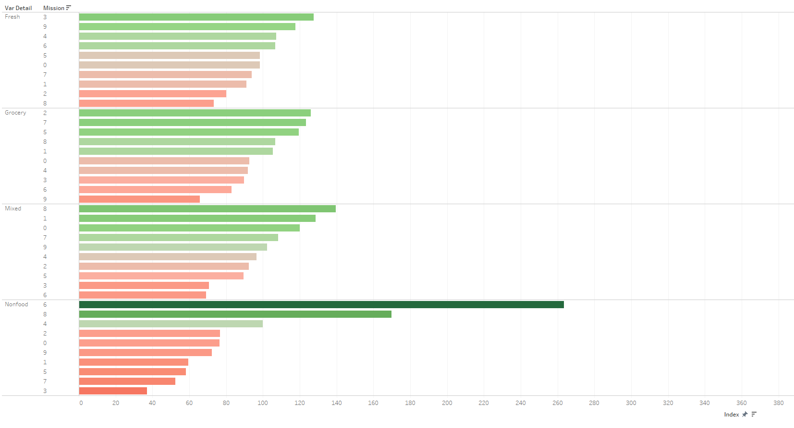
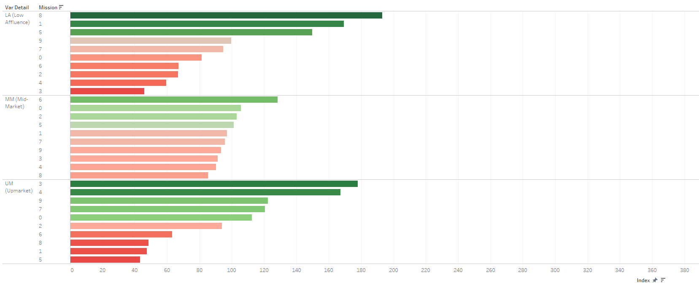

# Creating "Shopping Missions" with retailer data utilizing topic models from NLP

### Project scope

This project contains a pipeline, orchestrated with Airflow, for creating 'Shopping Missions' (a segmentation of transactions where each segment represents a 'mission' or reason for the customers' shop).  

The 'Shopping Missions' are generated taking inspiration from NLP and are generated through the use of an LDA algorithm similar to how 'topics' are generated in topic modelling.  

The output of the pipeline is a transaction file with each transaction tagged with a 'Shopping Mission'.

### Data utilized

The data used to create the 'Shopping Misisons' was provided open source by Dunnhumby, a global leader in retail analytics. The dataset contained a sample of 117 weeks of ‘real’ customer data from a large grocery store constructed to replicate typical pattern found in in-store data to allow the development of algorithms in a (near) real-world environment. The dataset can be downloaded from the following location:

https://www.dunnhumby.com/careers/engineering/sourcefiles

The actual data utilized was from the “Let’s get sort of real” section, specifically the data from a randomly selected group of 5,000 customers.

### Infrastructure

The infrastructure utilized in the pipeline is shown in the diagram below:

The decision to utilize Spark was taken as retailer data is typically very large and this use-case requires each transaction to be 'scored' with a 'Shopping Mission'.  As the number of transactions typically runs into millions scaleability quickly becomes an issue with standard Python libraries.

PyCharm was utilized as the IDE and code was automatically deployed to an ec2 instance with Airflow installed with a Postgres RDS instance.  Data was stored in an s3 bucket, data processing and modelling is run with PySpark and SparkML.  

### Airflow Orchestration

In order to run Airflow it was installed on the same EC2 cluster where the code is deployed.  Steps to install Airflow using a Postgres database can be found [here](https://medium.com/@abraham.pabbathi/airflow-on-aws-ec2-instance-with-ubuntu-aff8d3206171)

The image below illustrates the orchestration of the tasks within Airflow:

  

The DAG contains the following tasks:

**create_app_egg:**  Creates an egg file from the latest code  
**upload_app_to_s3:**  Uploads the application egg and Spark runner files containing the main functions to S3  
**create_job_flow:**  Creates an EMR cluster  
**branching:**  Determines if new models should be trained or if an existing model should be utilized to score a new transaction file  
**add_step_XXX:**  Adds Spark steps for staging data, pre-processing data, training and tuning LDA models, profiling and model scoring  
**watch_stage_XXX:**  Sensors for each staging step to determine when they are complete  
**remove_cluster:**  Terminates the cluster when all steps are completed  

### Model Details

In order to create 'Shopping Missions' LDA was utilized in a similar way to topic modelling from NLP.  Each transaction was considered to be a document and the items words within a document.  

The diagram below illustrates 2 examples of the types of 'Shopping Missions' that can be found utilizing this technique:  

LDA is particularly suited to this task because it is not influenced by the order in which the items are added to the basket in the same way that the order of the words in a document does not influence the topic to which the document is assigned.  

### Example Output

The charts below show charts created from the output from the profiling module of the pipeline and illustrate that there is some clear differentiation between the assigned 'Shopping Missions'.

For example, it is clear that different missions are discriminating based on their size:

The chart shows that missions 6, 5 and 2 are significantly more likely to be 'small shops' while missions 1, 0 and 9 are more likely to be 'large' shops.  

 

Missions 3, 9 and 4 are more likely to contain predominantly fresh items while missions 2, 7 and 6 are more likely to contain predominantly grocery items.  Missions 8, 1 and 0 are more likely to contain a mix of fresh and grocery while missions 6 and 8 contained mostly non-food items.  

There is also clear discrimination in they types of items in each basket.  The data provided included a 'basket price sensitivity' segmentation that tagged baskets as Low Affluence, Mid-Market and Up-Market depending on the types of items it contained.

Missions 0, 1 and 6 were more likely to be Low Affluence baskets while 3 and 4 were more likely to be Upmarket.